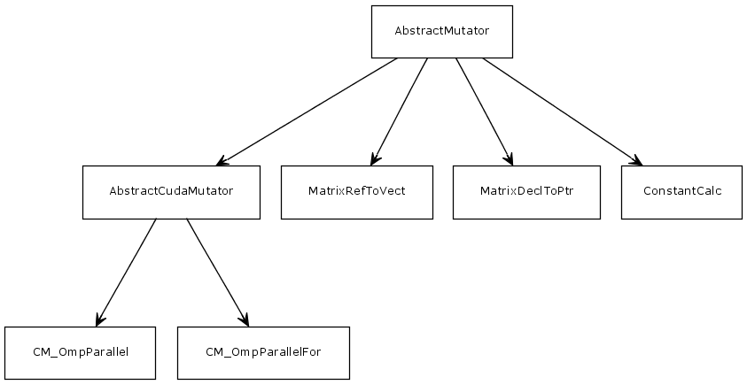

Common 
*****************
.. module:: Common
   :synopsis: Common classes for all backends

The Common module contains common operations to the different backends.

Mutators
=================

Some :term:`Mutator` are declared on the :mod:`Mutators` module. 

AbstractMutator
-------------------

As you may see on the diagram, all mutators inherits from :class:`AbstractMutator`.

.. automodule:: Backends.Common.Mutators.AbstractMutator
   :members: AbstractMutator

AstSupport
-------------------

Additional mutators are provided in order to easier the backend writing process. 

.. automodule:: Backends.Common.Mutators.AstSupport
   :members: 

Filter visitors
=================

.. warning:: Mabye a name change is needed, *SearchVisitor* will be more clear.

.. warning:: Some cleaning needs to be done in this module.

In order to search nodes on the AST, the programmer needs to implements a :term:`Filter`. 
:class:`GenericFilterVisitor` is the parent of all filters, defining the commom methods
of all filters.

This module has other members, which are concrete implementations of the :class:`GenericFilterVisitor`.

.. automodule:: Backends.Common.Visitors.GenericVisitors
   :members: GenericFilterVisitor
