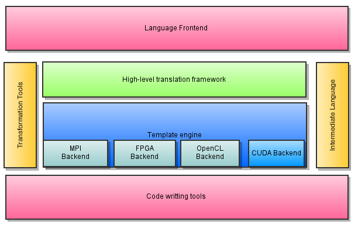

.. llCoMP documentation master file, created by
   sphinx-quickstart on Mon Jun 21 11:41:53 2010.
   You can adapt this file completely to your liking, but it should at least
   contain the root `toctree` directive.

Welcome to llCoMP's documentation
==================================

llCoMP is a translator framework designed for *fast prototyping*. 
With little effort, you can build translators from OpenMP/C to any specific computation language.
Currently we have implemented the CUDA Backend, but we have plans to implement new ones.

.. _layered_design:

In the diagram (layered_design_), the different layers of the framework are exposed. 

The uppermost level contains the :mod:`Frontend`, which gives the tools required to transform 
the source code into the internal representation.

The 

Contents:

.. toctree::
   :maxdepth: 2

   frontend.rst
   tools.rst

Indices and tables
==================

* :ref:`genindex`
* :ref:`modindex`
* :ref:`search`

